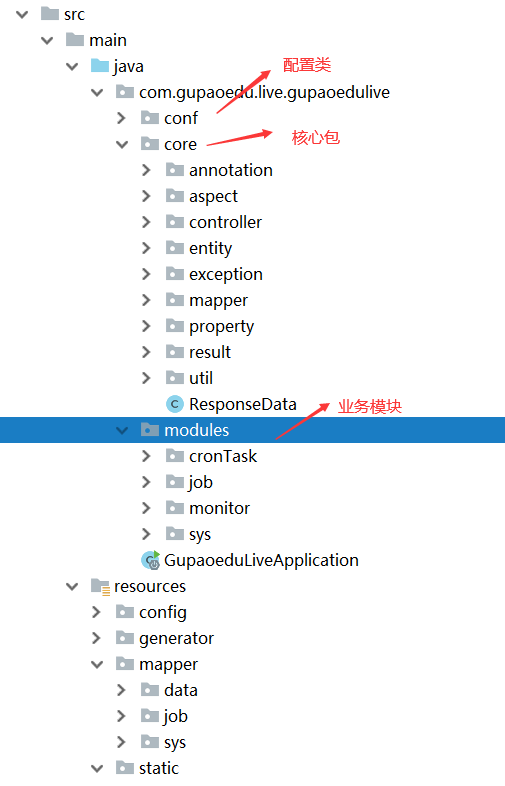
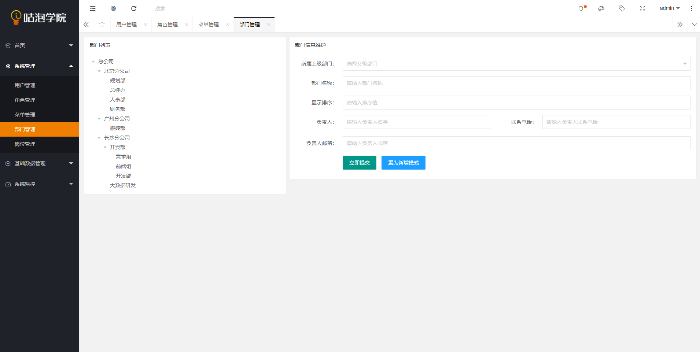
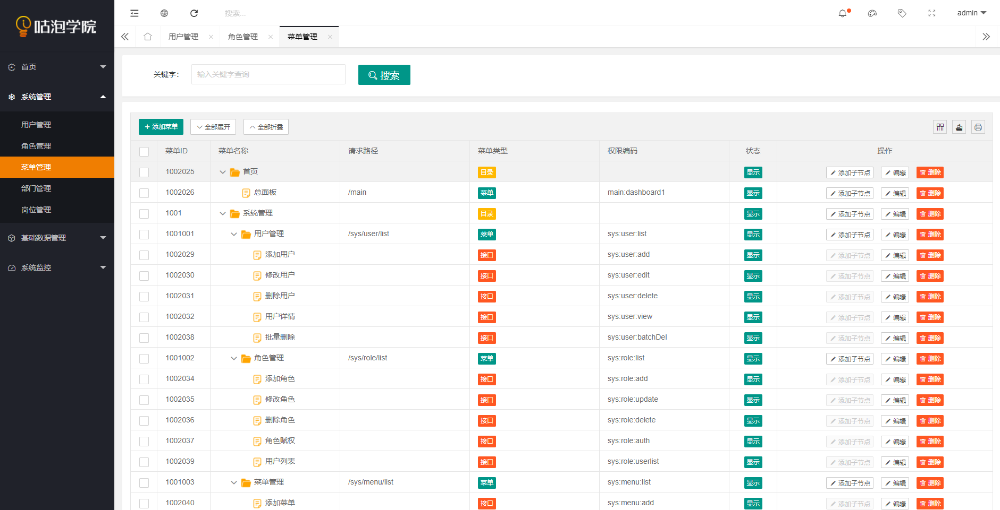
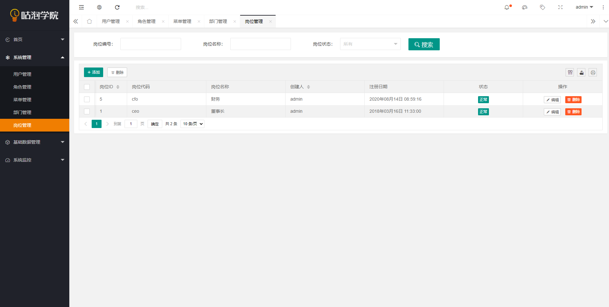
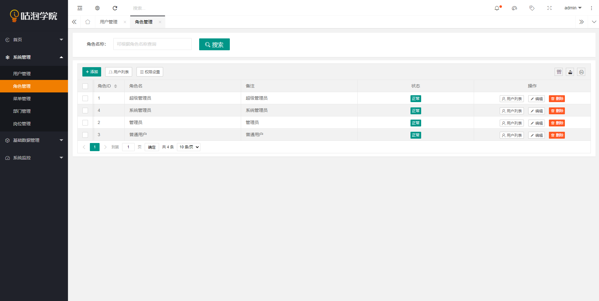

# 项目介绍

基于Layui 做的一个后台管理系统的脚手架。

后台技术采用Spring Boot + Mybatis

权限采用的是Shiro

数据库采用mysql

# 模块介绍




# 运行向导

* 运行dbscript数据库脚本

* 修改application.properties数据库连接字符串

  ```properties
  spring.datasource.driverClassName=com.mysql.cj.jdbc.Driver
  spring.datasource.url=jdbc:mysql://localhost:3306/gupao-live?useUnicode=true&characterEncoding=utf8&useOldAliasMetadataBehavior=true&zeroDateTimeBehavior=convertToNull&allowMultiQueries=true&serverTimezone=UTC&serverTimezone=Asia/Shanghai
  spring.datasource.username=root
  spring.datasource.password=root
  spring.datasource.hikari.minimum-idle=5
  spring.datasource.hikari.maximum-pool-size=30
  spring.datasource.hikari.idle-timeout=600000
  spring.datasource.hikari.max-lifetime=1800000
  spring.datasource.hikari.connection-timeout=500
  spring.datasource.hikari.login-timeout=500
  spring.datasource.hikari.validation-timeout=1000
  spring.datasource.hikari.initialization-fail-timeout=1000
  ```

* 运行 GupaoeduLiveApplication

# 界面截图











